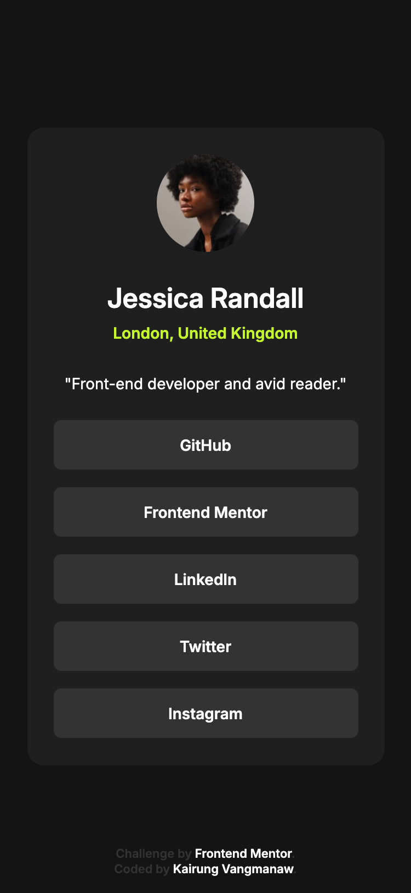
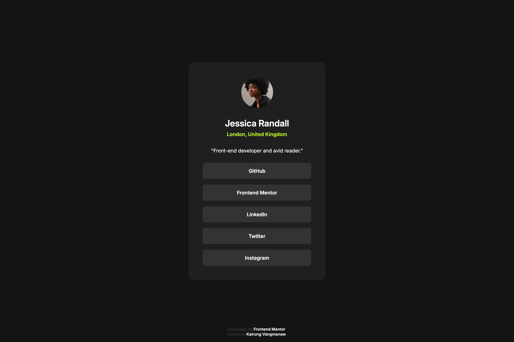
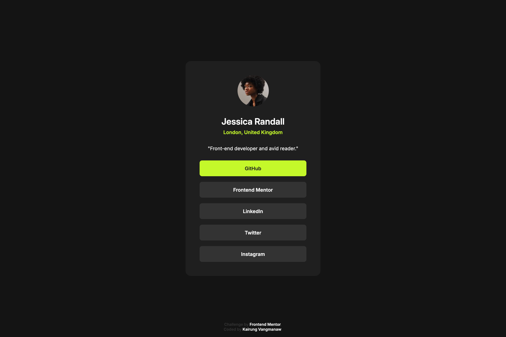

# Frontend Mentor - Social links profile solution

This is a solution to the [Social links profile challenge on Frontend Mentor](https://www.frontendmentor.io/challenges/social-links-profile-UG32l9m6dQ). Frontend Mentor challenges help you improve your coding skills by building realistic projects.

## Table of contents

- [Frontend Mentor - Social links profile solution](#frontend-mentor---social-links-profile-solution)
  - [Table of contents](#table-of-contents)
  - [Overview](#overview)
    - [The challenge](#the-challenge)
    - [Challenge result](#challenge-result)
    - [Screenshot](#screenshot)
    - [Links](#links)
  - [My process](#my-process)
    - [Built with](#built-with)
    - [What I learned](#what-i-learned)
    - [Continued development](#continued-development)
  - [Author](#author)
  - [Acknowledgments](#acknowledgments)

## Overview

### The challenge

Users should be able to:

- See hover and focus states for all interactive elements on the page

### Challenge result

- 18 Sep 2025
  - ✅ See hover and focus states for all interactive elements on the page

### Screenshot

- Mobile view

  

- Desktop view

  

- Active state view

  

### Links

- Solution URL: [Social Links Profile Challange using HTML and CSS](https://www.frontendmentor.io/solutions/test-qpWd-y8VlX)
- Live Site URL: [Frontend Mentor Challange | Social links profile](https://vangmanawkairung.github.io/frontend-mentor-social-links-profile/)

## My process

### Built with

- Semantic HTML5 markup
- CSS custom properties (variables)
- Flexbox
- Mobile-first workflow
- Media queries for responsive design
- GitHub Pages for deployment

### What I learned

- **Layout-first workflow**: I learned that starting with the layout first and then adding details later makes the development process much faster and more efficient.
- **Centering with position and translate**: I learned why using `position: absolute; top: 50%; left: 50%;` places the element’s top-left corner in the center. Adding `translate(-50%, -50%)` repositions the element so its center aligns with the parent’s center.
- **Alternative centering methods**: I learned that using flexbox or grid is a cleaner and more modern approach for centering elements compared to the position/translate method.
- **CSS custom properties (variables)**: I learned that defining CSS variables by usage area (e.g., `--button-bg, --card-bg`) is more practical and makes the code easier to maintain than naming them after literal colors.
- **Responsive design with media queries**: I learned how to apply media queries to adapt the layout for different screen sizes, following a mobile-first approach and then scaling up to desktop.
- **Hover states for interactivity**: I learned how to use hover effects (`:hover`) on buttons to provide visual feedback, making the interface more interactive.
- **Accessibility with aria-label**: I learned the importance of `aria-label` for accessibility, especially for interactive elements like social links that might use icons or generic text, ensuring screen readers can describe them clearly.

### Continued development

For future projects, I want to focus more on accessibility. In particular, I plan to practice implementing `aria-label` properly to make interactive elements more user-friendly for screen readers and to ensure the website feels more complete and professional.

## Author

- GitHub: [Kirung Vangmanaw](https://github.com/VangmanawKairung)
- Frontend Mentor - [@VangmanawKairung](https://www.frontendmentor.io/profile/VangmanawKairunge)

## Acknowledgments

I would like to sincerely thank myself for staying persistent and continuing to push forward. A big thank you to the **Frontend Mentor team** for creating this challenge and giving me the opportunity to practice and improve my skills. I am also grateful to **OpenAI** and **Google** for developing **ChatGPT** and **Gemini**, which helped me complete this challenge and explore new techniques. A special thanks to **Figma** for providing an intuitive design tool that made translating designs into code much smoother. Lastly, I want to express my appreciation to every tool, program, and source of encouragement that supported me throughout this process. Without them, completing this challenge successfully would not have been possible.
